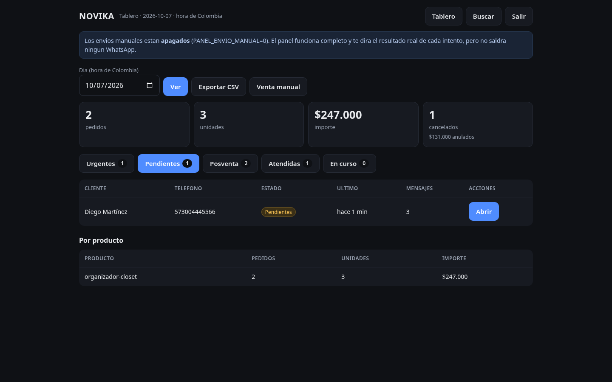
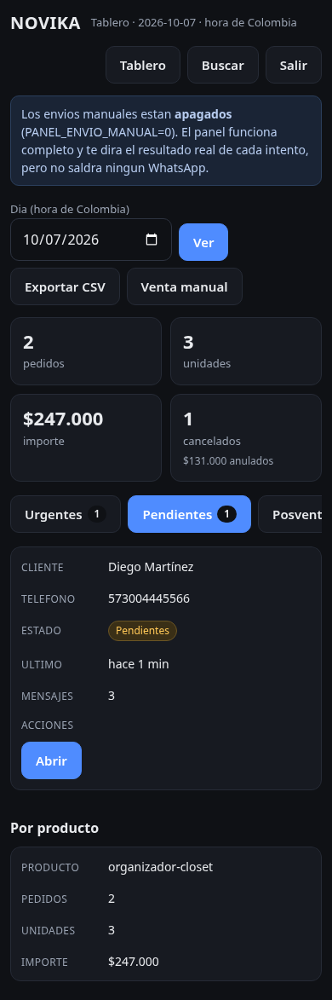
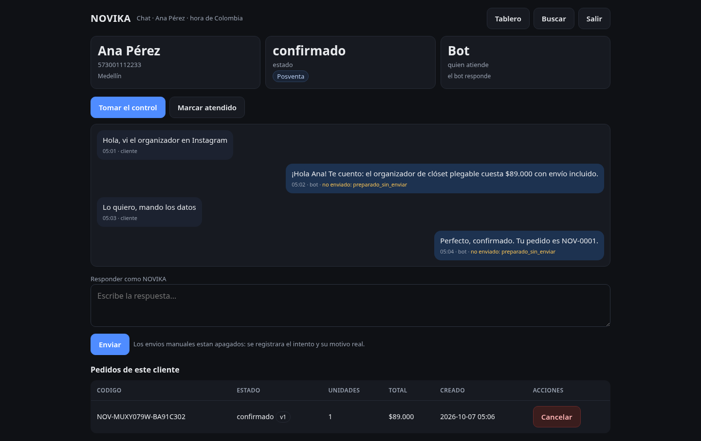
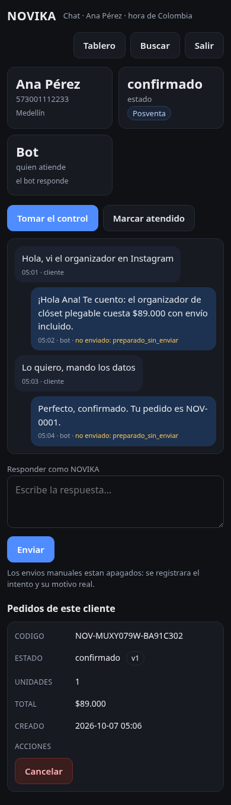
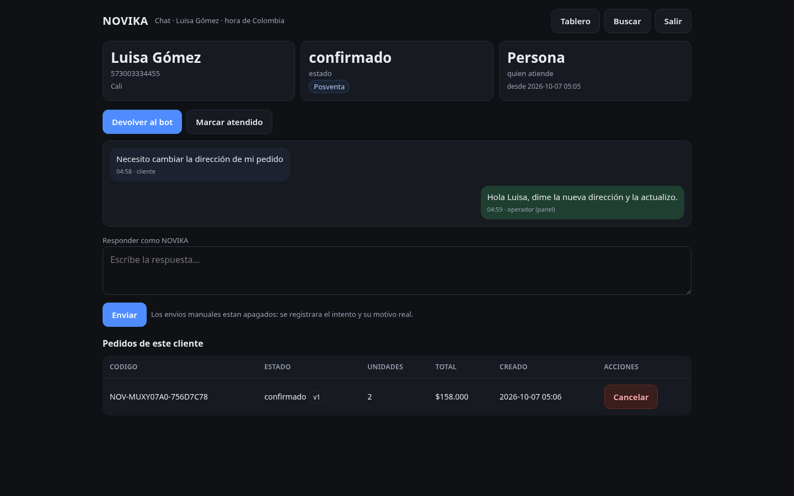
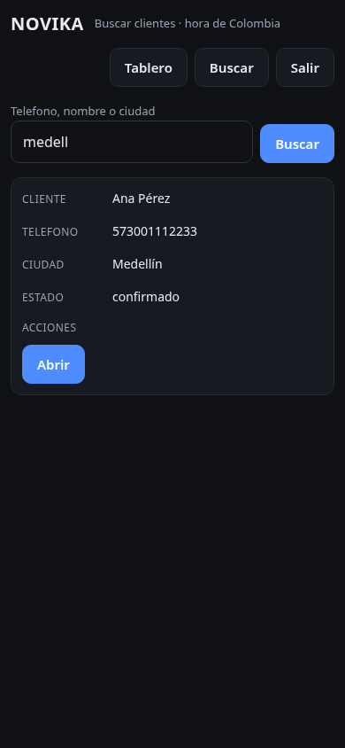
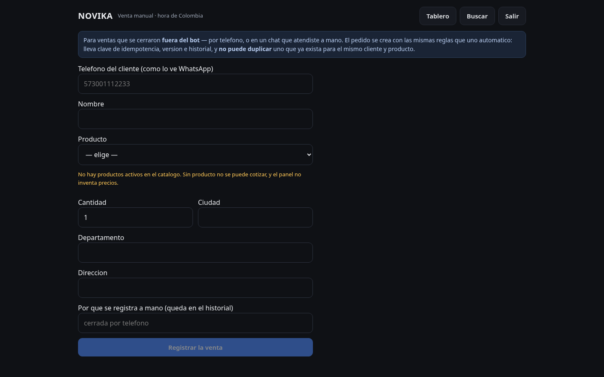
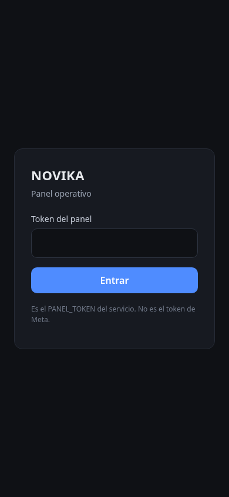
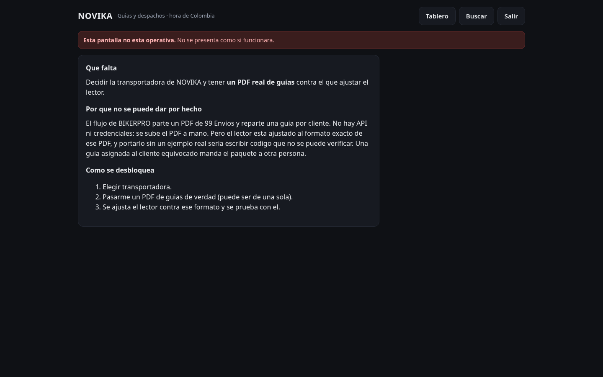

# Panel operativo de NOVIKA

Adaptado del panel de BIKERPRO, reutilizando sus funciones y las correcciones que fue acumulando. La auditoría de origen y la correspondencia función por función está en [`PANEL-DE-BIKERPRO-A-NOVIKA.md`](PANEL-DE-BIKERPRO-A-NOVIKA.md).

**Estado: funcional.** Los envíos de WhatsApp están detrás de su propio interruptor, apagado.

---

## Cómo entrar

```
https://novika-bot.onrender.com/panel
```

Pide el `PANEL_TOKEN` del servicio. **No es el token de Meta** — son dos credenciales distintas, y hay una prueba que falla si alguien vuelve a confundirlas.

El token se manda **una vez** por POST y lo que queda es una cookie firmada, `HttpOnly`, válida 12 horas. No va en la URL: una URL con un secreto dentro se queda en el historial del navegador, en las cabeceras `Referer` y en los logs de cualquier proxy.

> `/metricas` y `/eventos` siguen aceptando `?token=` como antes. Eso no cambia.

---

## Lo que hace

| Pantalla | Qué resuelve |
|---|---|
| **Tablero** | Pedidos, unidades, importe y cancelados de un día, en hora de Colombia. Desglose por producto |
| **Pestañas** | Urgentes · Pendientes · Posventa · Atendidas · En curso, con su cuenta |
| **Chat** | La conversación completa, responder a mano, tomar el control, marcar atendido |
| **Buscar** | Por teléfono, nombre o ciudad |
| **Venta manual** | Ventas cerradas fuera del bot, cotizadas por el mismo motor |
| **Exportar** | CSV de pedidos, abre bien en Excel en español |
| **Auditoría** | Últimos 14 días. Dice "sin datos" mientras no haya pedidos |

### Clasificación

El orden de las comprobaciones es el orden de urgencia: un chat que cumple dos cosas aparece en la más urgente, porque si aparece en la más tranquila nadie lo mira.

- **Atendida** — una persona lo resolvió después del último mensaje del cliente.
- **Urgente** — el cliente escribió y lleva más de 15 minutos sin respuesta.
- **Pendiente** — el cliente escribió y nadie ha contestado.
- **Posventa** — ya hay pedido y la conversación sigue.
- **En curso** — el bot está conversando.

**"Atendido" no es un ocultar.** Se guarda *cuándo*, no un sí/no, y "está atendido" se calcula comparándolo con el último mensaje del cliente. Si el cliente vuelve a escribir, **reaparece solo** — nadie tiene que acordarse de borrar nada. BIKERPRO lo resolvía borrando la marca en cada camino que recibe un mensaje; el día que un camino nuevo se olvide, el chat queda silenciado para siempre, que es una venta perdida en silencio.

---

## Tomar el control: la carrera que BIKERPRO no cierra

Es el punto que más me importaba de esta entrega.

En BIKERPRO la pausa se comprueba **al empezar** el turno:

```
server.js:2780   if (store.isPaused(from)) continue;    ← la pausa se mira AQUÍ
server.js:2786   await ...                              ← la IA piensa, segundos
server.js:2791   await sendText(from, reply);           ← envía SIN volver a mirar
```

Si el operador toma el control **mientras el modelo piensa**, el bot contesta igual y el cliente recibe dos voces. Con Gemini en el camino de cada turno, esa ventana son segundos de verdad.

**En NOVIKA la comprobación está en `src/whatsapp/enviar.js`**, el único camino al exterior, y se ejecuta *después* de que la IA haya respondido y justo antes de escribir a la red:

```
el turno empieza        → nadie tiene el control, pasa
la IA piensa            → el operador toma el control desde el panel
el emisor va a enviar   → pregunta al disco: ¿pausada? → SÍ → no envía
```

Está en el punto de salida y no en cada flujo a propósito: así ningún camino nuevo tiene que acordarse. Probado en `test/panel.test.js`:

- el operador toma el control mientras la IA piensa → **el bot no envía, y no se llama a la API de Meta**
- sin que nadie tome el control → **sí envía** (el contraste importa: si bloqueara siempre, la prueba anterior pasaría por el motivo equivocado)
- devolver el chat al bot vuelve a permitir el envío
- la respuesta **manual** sí sale con el chat pausado — tomar el control pausa el bot precisamente para que escriba la persona
- **la pausa sobrevive a un reinicio** (en Render cada despliegue reinicia; en memoria, el bot volvería a hablar sin que nadie toque un botón)
- si no se puede leer la conversación, **no se envía**: callarse de más es recuperable

---

## Los envíos

Pasan por `src/whatsapp/enviar.js` con un permiso nuevo y explícito, `ATENCION_MANUAL`, y **su propio interruptor**:

```
PANEL_ENVIO_MANUAL=0    ← por defecto
```

Aparte de `RESPUESTA_AUTOMATICA` a propósito: ese interruptor existe para que **el bot** no hable, y una persona que pulsa enviar no es el bot. Pero tampoco puede quedar implícito, porque entonces el panel sería una puerta abierta a enviar WhatsApps reales sin haberlo decidido.

Con el interruptor apagado el panel se opera completo: el mensaje queda en la conversación con su motivo real y **no sale nada**.

### Nada se muestra como entregado sin estarlo

Tres finales distintos, y el panel los distingue:

| Resultado | Qué se muestra |
|---|---|
| Meta lo aceptó | "Meta aceptó el mensaje… la entrega se confirma con el acuse" (con su `wamid`) |
| Bloqueado | el motivo en lenguaje claro, y qué cambiar |
| Falló | el error traducido — la ventana de 24 h de Meta se explica, no se muestra como `131047` |

**Que Meta acepte un mensaje no significa que lo entregue.** BIKERPRO lo midió con su cierre diario: `ok:true` con `wamid`, y nunca entregado. La entrega real solo se da por buena cuando llega el acuse `delivered` por el webhook.

---

## Pedidos

**Cancelar no borra.** Se usa la transición del dominio (`dominioPedido.cancelar`), así que queda versionado y en el historial igual que si lo hubiera hecho el bot, con su motivo. Deja de contar como venta en todas las pantallas a la vez porque el filtro está en un solo sitio. *"Un pedido borrado es contabilidad que desaparece."*

**No hay "reactivar", y es deliberado.** El índice único de la clave de oferta es **parcial** (`WHERE estado <> 'cancelado'`) para que un cliente que cancela pueda volver a comprar. Eso significa que, después de una cancelación, puede haber **ya** otro pedido vivo con la misma clave: reactivar el viejo chocaría contra el índice. Un botón que falla la mitad de las veces por un motivo que nadie entiende es peor que no tenerlo. Lo correcto es registrar una venta nueva, que además deja el rastro de lo que de verdad pasó.

**La venta manual no acepta un importe escrito a mano.** El precio lo calcula el cotizador, igual que en una venta del bot: aceptar un importe del formulario sería la vía más fácil de meter un cobro equivocado en la contabilidad. Y lleva clave de idempotencia derivada del cliente, el producto y el día, así que **pulsar dos veces no duplica** — la segunda encuentra el que ya existe.

---

## Desde el celular

Las cuatro correcciones vienen de quejas reales en BIKERPRO, y aquí están fijadas con pruebas que fallan si alguien las deshace:

| | Por qué |
|---|---|
| Campos de **16px** mínimo | iOS hace zoom solo al enfocar un campo menor y la página salta. Pasaba justo al escribirle a un cliente |
| Botones de **44px** | La guía de Apple. Los suyos tenían ~30px |
| Tablas que **se apilan** con `data-label` | Siete columnas en 390px no se leen |
| La etiqueta **en el HTML**, no solo en el CSS | Una fila creada por JavaScript saldría sin etiqueta |

Y el estado que no se puede perder al actualizar:

- **borrador por conversación** (uno compartido mezclaría lo escrito a dos clientes);
- **no se borra el borrador si el envío falló**;
- **posición del scroll**;
- las acciones van por `fetch` y devuelven JSON — un redirect recargaría y **cerraría la conversación abierta**;
- el botón de enviar se desactiva, y hay además un candado de 8 s contra el doble envío.

> Y se mira el **estado HTTP** antes de interpretar el cuerpo. Un 401/403 devuelve texto; hacer `r.json()` a ciegas muestra `Unexpected token 'F'` y manda a buscar el problema donde no está. A ellos les pasó dos veces.

---

## Capturas

| Escritorio | Móvil (390px) |
|---|---|
|  |  |
|  |  |
|  |  |
|  |  |
|  | |

Hechas contra el HTML que devuelve el servidor de verdad, con datos de muestra inventados (ningún cliente real). Las horas aparecen en hora de Colombia.

---

## Una sola fuente de verdad

El panel **no copia el store de BIKERPRO**: dos sitios donde viven los pedidos son dos contabilidades que acaban discrepando.

Usa las **mismas** piezas que el bot —repositorios, catálogo y emisor— pedidas al cerebro ya construido (`_piezas()`). Si se construyera las suyas habría dos pools de conexiones, dos cargas del catálogo y, lo grave, dos caminos de escritura sobre los mismos pedidos. Hay una prueba que falla si el panel crea repositorios por su cuenta.

```
src/panel/
  auth.js     entrada, sesión firmada, comparaciones de tiempo constante
  fecha.js    día y hora de Bogotá, puras y con guarda
  datos.js    consultas y clasificación (no sabe nada de HTML)
  vistas.js   HTML, CSS y guion
  rutas.js    rutas, conectadas a los repos y al dominio
src/almacen/atencion.js   pausa, atención e historial, persistidos
```

`datos.js` no sabe nada de HTML a propósito: así las cuentas se prueban sin montar una página, y la pantalla no puede "arreglar" un número mal calculado.

---

## Lo que NO está operativo

No se presenta como si funcionara: cada pantalla dice qué falta y cómo se desbloquea.

### Guías y despachos — falta un PDF real

El flujo de BIKERPRO parte un PDF de **99 Envíos** y reparte una guía por cliente. No hay API ni credenciales: se sube el PDF a mano. Pero el lector está ajustado al formato exacto de ese PDF, y portarlo sin un ejemplo real sería escribir código que no se puede verificar. **Una guía asignada al cliente equivocado manda el paquete a otra persona.**

Para desbloquearlo: elegir transportadora y pasarme **un PDF de guías de verdad** (sirve una sola).

> Detalle técnico de su implementación que habrá que repetir: `pdfjs` **no devuelve la memoria** que usa (+71 MB por lote medido), así que corre en un proceso hijo.

### Novedades de entrega — faltan plantillas aprobadas por Meta

Una novedad se avisa días después del pedido, cuando la ventana de 24 h ya se cerró. Fuera de esa ventana **Meta solo entrega plantillas aprobadas**: con texto libre acepta el mensaje y no lo entrega, así que el cliente nunca se enteraría y nosotros creeríamos que sí.

Hay que crear en Meta Business Manager y esperar aprobación:

- `PLANTILLA_NOVEDAD_AUSENTE`
- `PLANTILLA_NOVEDAD_DIRECCION`
- `PLANTILLA_NOVEDAD_OFICINA`

### Atribución y embudo — falta dato, no código

Cruzan el `referral` de los anuncios con los pedidos. NOVIKA no tiene productos activos ni pedidos, así que cualquier número aquí sería inventado. La pantalla se enciende sola en cuanto haya pedidos; la atribución necesita además anuncios de Click-to-WhatsApp activos.

---

## Para desplegarlo

| | |
|---|---|
| `PANEL_TOKEN` | **Ya está configurado.** Es el que pide la pantalla de entrada |
| `PANEL_ENVIO_MANUAL` | No está. Sin ella, el panel funciona y no envía. Ponla en `1` cuando quieras poder responder de verdad |

Bloqueos reales:

1. **El panel va en PR aparte y sin fusionar.** Y depende de PR #4 (Fase 3A), que tampoco está fusionado.
2. **Migración `002`.** Añade `atencion` y `mensajes` a la conversación. Sobre archivos no hace falta nada; **si algún día se activa PostgreSQL hay que aplicarla** con `npm run migrar`, antes de poner `DATABASE_URL`.
3. **El catálogo no tiene productos activos**, así que la venta manual no tiene de dónde elegir y la auditoría dirá "sin datos". No es un fallo del panel: es que todavía no hay productos definidos, y el panel no inventa ninguno.
4. **Responder de verdad necesita `WHATSAPP_TOKEN`** en el servicio y `PANEL_ENVIO_MANUAL=1`.
